# Setup guide

This is the step-by-step companion to the **web install wizard** at
`http://127.0.0.1:8780/wizard`. The wizard links each step to the
matching anchor below for the click-by-click provider walkthrough.

You can also follow this guide top to bottom from the terminal — `./install.sh`
covers the same flow interactively.

---

## Contents

- [1. Before you start](#welcome) — privacy / cost / threat-model
- [2. Anthropic API key](#anthropic) **(required)**
- [3. Pick a transport](#pick-transport) **(required)** — how the agent talks to you
  - [iMessage](#transport-imessage) (macOS only)
  - [Telegram](#transport-telegram)
  - [Discord](#transport-discord)
  - [Slack](#transport-slack)
  - [SMS via Twilio](#transport-sms)
- [4. Optional sub-agents](#sub-agents) — pick the integrations you want
  - Google family ([Cloud project setup](#google-cloud-project), then per service):
    [Gmail](#gmail) · [Calendar](#calendar) · [Drive / Docs / Sheets](#google-drive-docs-sheets)
  - [Todoist](#todoist) · [Notion](#notion) · [GitHub](#github)
  - [Web search (Brave)](#brave) · [YouTube](#youtube)
  - [Dropbox](#dropbox) · [Spotify](#spotify)
  - [Maps (Google)](#maps-google)
  - [Eight Sleep](#eightsleep)
  - [Canva](#canva) · [LinkedIn](#linkedin)
- [5. Schedule + email triage](#triggers-email) — morning brief, weekly review
- [6. Behavior defaults](#behavior) — timezone, model
- [7. Install LaunchAgents](#launchagents) — make it run on login
- [Troubleshooting](#troubleshooting)

---

##  1. Before you start

This is a **single-user, local-first** tool. It stores a lot of personal data on
your machine and sends a lot of personal data to Anthropic on your behalf.

- **Costs:** every Claude turn costs real money. Typical use is ~$1–3/day,
  build/iteration days can spike to $10+. Watch spend at
  `http://127.0.0.1:8780/observability`.
- **Storage:** every conversation, every fact, every API call lives in
  `data/memory.sqlite` (gitignored, owner-only file perms).
- **Network:** every message you send, every assistant reply, every email
  body the scheduler triages goes to Anthropic. No analytics, no telemetry.
- **Web UI:** binds to `127.0.0.1` only. No auth. Treat it like a local
  database port — don't expose it to your LAN.

Full threat model: [README.md → Privacy & security profile](v1/README.md#privacy--security-profile).

If you're installing on a fresh checkout, the wizard will start by copying
`.env.example` → `.env` for you. If you're migrating from another machine,
the wizard's first step has an "import from another v1/" form that copies
your previous `.env`, `config/credentials.json`, `data/google_token.pickle`,
`data/memory.sqlite`, and `config/triggers.yaml`.

---

##  2. Anthropic API key

**You'll do:** create an Anthropic console account, generate an API key, paste it in.

**Why:** powers every Claude call. Without it, no agent.

**Click path:**

1. Open <https://console.anthropic.com> and sign in (or sign up — debit card
   required even for the free tier).
2. Top-right avatar → **Settings** → **API Keys**.
3. Click **Create Key**, give it a name (e.g. `personal_agent`).
4. Copy the `sk-ant-…` value — it's only shown once.
5. In the install wizard, paste it in the "Anthropic API key" step and click
   Save. (Or set `ANTHROPIC_API_KEY=…` in `.env` manually.)

**Cost:** pay-as-you-go. Roughly $0.01–0.05 per chat turn (Sonnet), $0.10–0.30
per morning brief (Opus 4.7), and sub-cent for each email-triage call (Haiku).
Watch spend any time with `python -m tools.cost_report` or
[/observability](http://127.0.0.1:8780/observability).

**Verify:** the wizard's "Verify" button runs `python -m tools.token_health`
against your key. A green check + "Anthropic OK" means you're good.

---

##  3. Pick a transport

One transport at a time. You can switch later by re-running the wizard or
editing `RELAY_TRANSPORT` in `.env`.

| Transport | Where it shines | Caveats |
|---|---|---|
| iMessage | Native iPhone integration; "Note to Self" thread feel | macOS-only; needs Full Disk Access + Automation perms |
| Telegram | Cross-platform; survives iOS Focus / DND | Need to create a bot via @BotFather |
| Discord | DMs + opt-in server channels | Server channels require Message Content Intent |
| Slack | Workplace surface; channel support | Need to add scopes + event subscriptions in the app config |
| SMS (Twilio) | Universal reach (any phone, any carrier) | Text-only (no image attachments); ~$1/mo + per-message cost |

Detailed setup per transport ↓

###  iMessage

**You'll do:** grant macOS permissions, set your phone number in `.env`,
optionally opt in to group chats.

**Click path:**

1. The relay reads `chat.db` and sends via AppleScript — both need permissions.
2. **System Settings → Privacy & Security → Full Disk Access** → click `+` → add
   your Python binary
   (e.g., `/opt/homebrew/Cellar/python@3.13/3.13.x/Frameworks/Python.framework/Versions/3.13/Resources/Python.app`).
3. **Automation → Messages** is granted on first AppleScript send (macOS
   prompts; click Allow).
4. In the wizard, pick **Mode**: `self` if you want to text yourself from your
   iPhone, `contact` if you want a specific other person to talk to the agent.
5. Set **TARGET_PHONE_NUMBER** in E.164 format (`+15551234567`).
6. Optional: opt in to group chats. Run `python -m relay.imessage_relay --check`
   to see every group visible in your chat.db (with display names + IDs), then
   paste the IDs into **IMESSAGE_GROUP_CHATS**.

**Verify:** the wizard's "Verify" button runs the same `--check` and prints
chat.db readability, target handle resolution, etc.

###  Telegram

**You'll do:** create a bot via @BotFather, find your user ID via @userinfobot.

**Click path:**

1. In Telegram, search for **@BotFather** and start a chat.
2. Send `/newbot`. Pick a display name (e.g. "My Personal Agent"), then a
   username ending in `bot` (e.g. `my_personal_agent_bot`).
3. BotFather replies with a token like `123456:ABC-DEF…`. Copy it.
4. Paste as **TELEGRAM_BOT_TOKEN** in the wizard.
5. Search for **@userinfobot**, start it. It replies with your numeric user ID.
6. Paste as **TELEGRAM_ALLOWED_USER_IDS** (comma-separated for multiple
   accounts).
7. In Telegram, send `/start` to your bot once so Telegram lets the bot reply.

**Optional — group chats:** add the bot to a Telegram group, send a message,
copy the negative chat ID from the daemon log on first run (or use @RawDataBot).
Add it to **TELEGRAM_ALLOWED_CHAT_IDS**. To let the bot see all messages (not
just direct mentions), @BotFather → `/setprivacy` → Disable.

###  Discord

**You'll do:** create a bot in the Discord Developer Portal, invite it to a
server, copy your user ID.

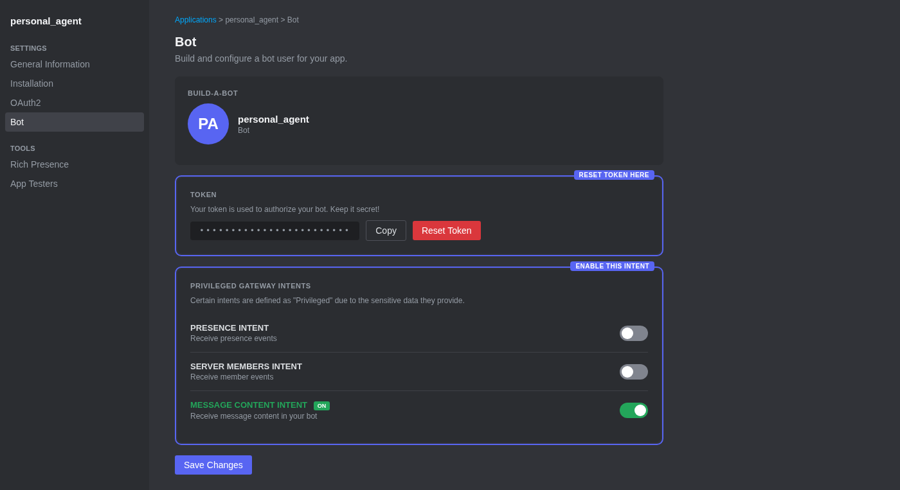

**Click path:**

1. Open <https://discord.com/developers/applications> → **New Application** →
   name it `personal_agent` → Save.
2. **Bot** tab → toggle **Message Content Intent** ON (it's a "privileged"
   intent; required to read DM text). → **Reset Token** → copy the value. Save
   as **DISCORD_BOT_TOKEN**.
3. **OAuth2 → URL Generator** → Scopes: `bot`. Bot Permissions:
   `Send Messages`, `Read Message History`, `Attach Files`.

   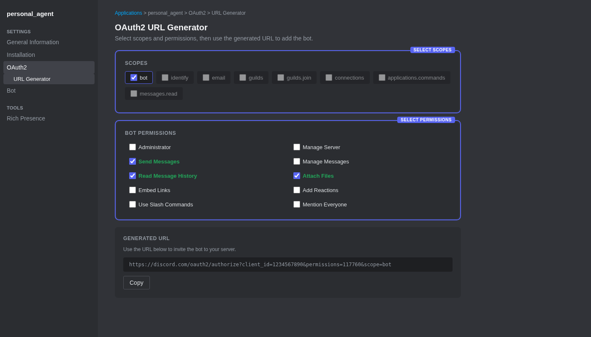

4. Copy the generated URL, paste in browser, pick a server you admin (a private
   "personal-agent" server works fine), authorize.
5. In Discord client: **Settings → Advanced → Developer Mode** ON.
6. Right-click yourself → **Copy User ID**. Save as **DISCORD_ALLOWED_USER_IDS**.

**Optional — server channels:** right-click any channel in the server → Copy
Channel ID (Developer Mode required). Paste into **DISCORD_ALLOWED_CHANNEL_IDS**.
The bot will only respond in those channels when @-mentioned (or when the
message matches **DISCORD_GROUP_TRIGGERS**).

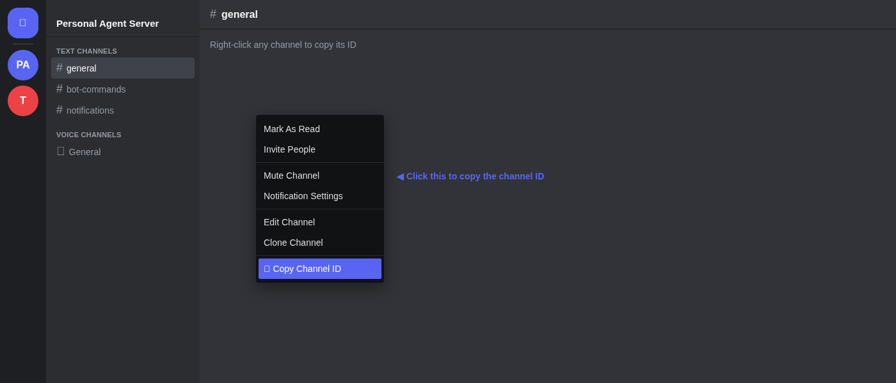

###  Slack

**You'll do:** create a Slack app, enable Socket Mode, install to your
workspace.

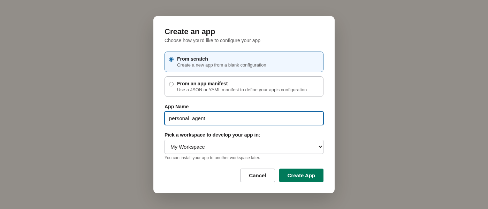

**Click path:**

1. <https://api.slack.com/apps> → **Create New App** → **From scratch** → name
   `personal_agent` → pick a workspace you control.
2. **Socket Mode** → **Enable**. Click **Generate token name** → name it
   `personal_agent_socket`, scope `connections:write`. Copy the `xapp-…`
   token. Save as **SLACK_APP_TOKEN**.

   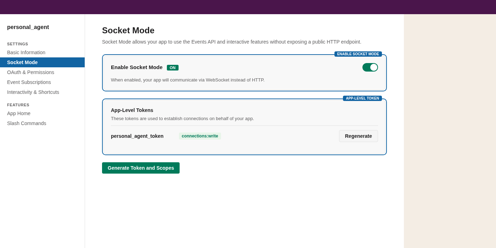

3. **OAuth & Permissions → Bot Token Scopes** → add: `chat:write`,
   `im:history`, `im:read`, `files:read`, `users:read`. Then **Install to
   Workspace**. Copy the **Bot User OAuth Token** (`xoxb-…`). Save as
   **SLACK_BOT_TOKEN**.

   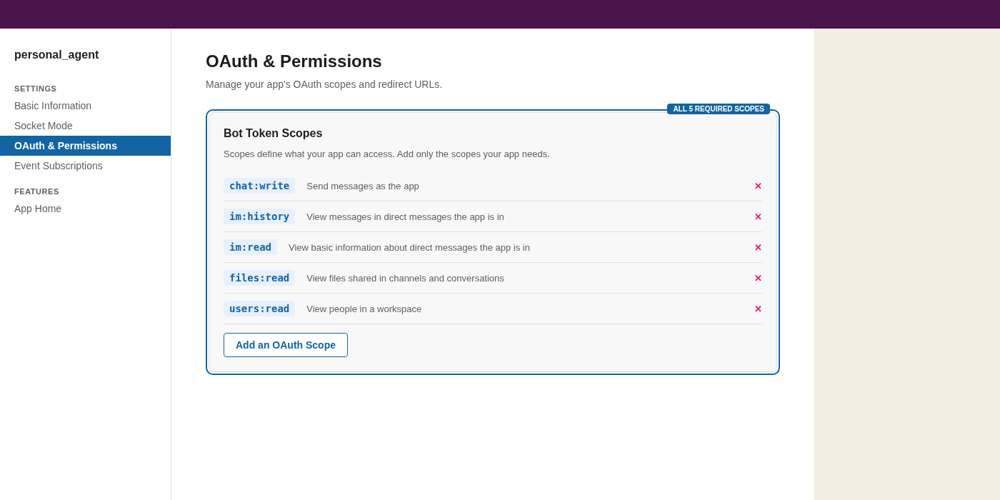

4. **Event Subscriptions → Enable Events** → **Subscribe to bot events** → add
   `message.im`. If you want channels too: also add `message.channels`,
   `message.groups`, `message.mpim`. Save.

   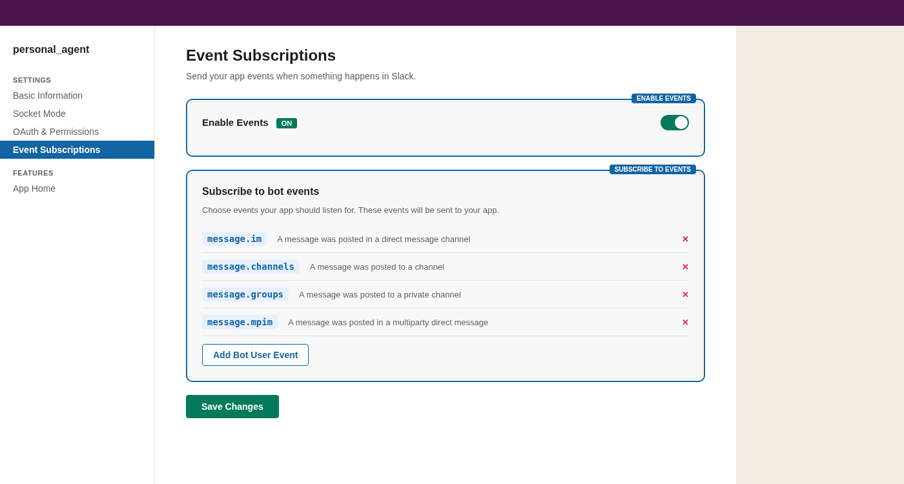

5. In Slack, click your profile → **⋯ More** → **Copy member ID** (`U…`).
   Save as **SLACK_ALLOWED_USER_IDS**.

**Optional — channels:** invite the bot (`/invite @your-bot` in the channel),
get the channel ID (channel name → ⋯ → Copy link, the last segment is `Cxxx…`).
Paste into **SLACK_ALLOWED_CHANNEL_IDS**.

###  SMS via Twilio

**You'll do:** sign up at Twilio, buy a number, copy credentials, set up a
public webhook so Twilio can deliver inbound SMS.

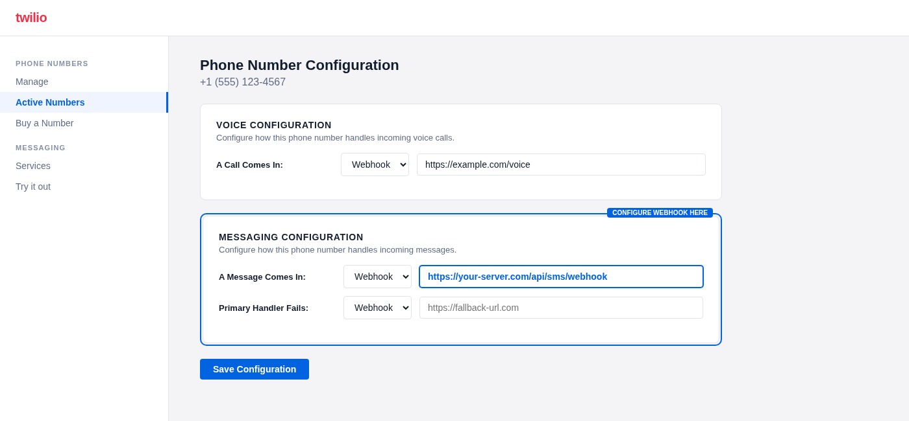

**Click path:**

1. <https://www.twilio.com> → sign up, verify email + phone. (Free trial gives
   you ~$15 credit.)
2. **Phone Numbers → Buy a number** → SMS-capable → buy (~$1/mo).
3. Top-right account → **API keys & tokens** → copy **Account SID** and
   **Auth Token**. Save as **TWILIO_ACCOUNT_SID** and **TWILIO_AUTH_TOKEN**.
4. Save your purchased number in E.164 format (`+15551234567`) as
   **TWILIO_FROM_NUMBER**.
5. Set **SMS_ALLOWED_NUMBERS** to at least your own phone (E.164). The relay
   rejects every other inbound message.
6. Start the relay (the wizard's "Verify" / Save & Restart does this) — it
   listens on `http://127.0.0.1:8781/sms/webhook`.
7. **Expose that URL publicly** so Twilio can POST to it:
   - **Dev:** `ngrok http 8781` in a separate terminal. Copy the
     `https://…ngrok-free.app` URL.
   - **Prod:** put the relay behind nginx / Caddy with HTTPS termination,
     pointed at the same local port.
8. **Twilio Console → Phone Numbers → Manage → Active numbers → your number →
   Messaging configuration** → set **A MESSAGE COMES IN** to
   `<your-public-url>/sms/webhook` with method `HTTP POST`. Save.
9. Text your Twilio number from one of the allowed phones. You should get a
   reply within seconds.

**Cost note:** ~$1/mo for the number + ~$0.008 per inbound + ~$0.008 per
outbound message. A typical day is under $1.

**Caveat:** SMS is text-only. No image attachments, so the vision sub-agent
isn't reachable on this transport.

---

##  4. Optional sub-agents

Pick which integrations you want. The wizard's sub-agent picker is a single
screen with toggle switches — opt in to the ones you want, then walk through
each one's setup screen.

You can always come back to `/wizard` later to enable more.

###  Google Cloud project (one-time setup)

Required if you want Gmail, Calendar, Drive, Docs, or Sheets. The five
sub-agents share **one** OAuth client + **one** cached token.

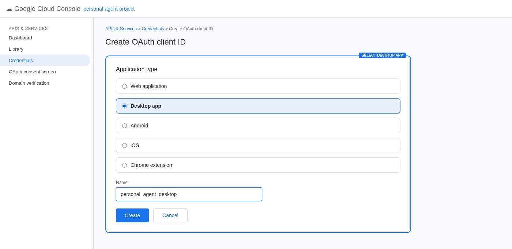

**Click path:**

1. <https://console.cloud.google.com> → top-left project dropdown → **New
   Project** → name it `personal_agent` → Create.
2. Make sure the new project is selected. **APIs & Services → Library** → enable
   each of:
   - Gmail API
   - Google Calendar API
   - Google Drive API
   - Google Docs API
   - Google Sheets API

   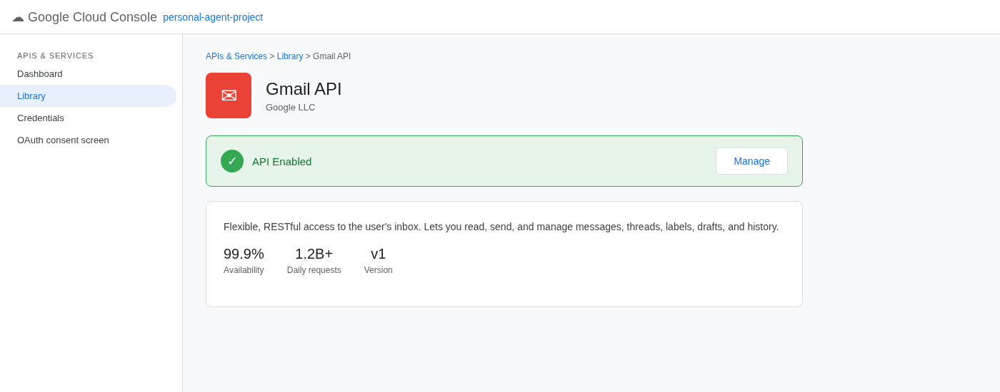

3. **APIs & Services → OAuth consent screen**:
   - User Type: **External** (unless you have Google Workspace — then
     **Internal**).
   - Fill in: app name `personal_agent`, your email, your email again. Skip
     scopes. Add yourself as a Test User.
   - Save.

   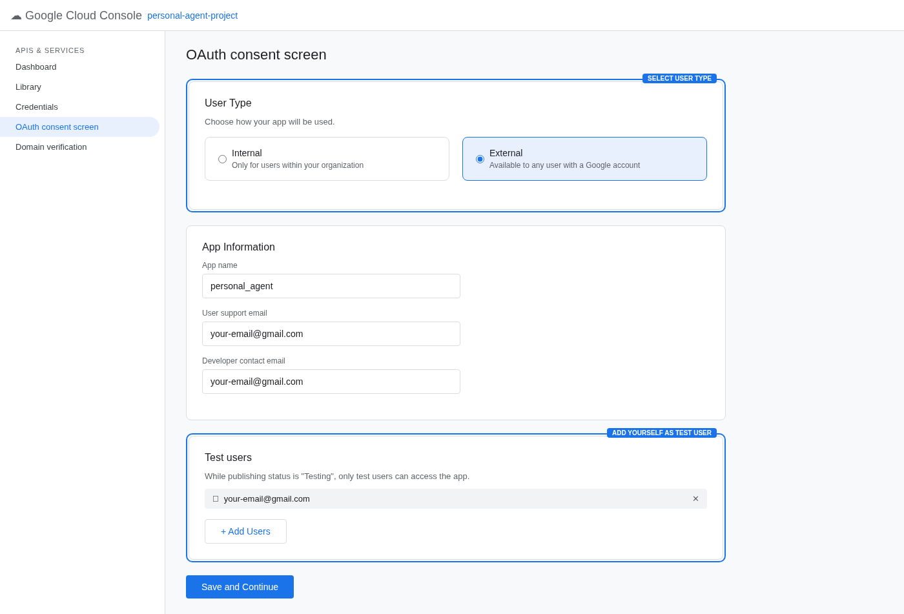

4. **Credentials → Create credentials → OAuth client ID**:
   - Application type: **Desktop app**.
   - Name: `personal_agent`. Create.
5. Download the JSON → in the wizard's Google OAuth step, upload it (it'll
   be saved to `config/credentials.json` at owner-only permissions).
6. The wizard's "Run OAuth" button opens a browser, you grant access, the
   token caches to `data/google_token.pickle`. Done.

**Verify:** the wizard runs `python -m mcp_servers.google_auth --check`.

###  Gmail

Once the Google Cloud project is set up, Gmail is on. The wizard skips you
through this step automatically.

###  Google Calendar

Same — shares the Google Cloud project. No extra config.

###  Drive / Docs / Sheets

Same — all three share the project + token. The wizard surfaces each as a
separate toggle so you can disable individual ones.

###  Todoist

**Click path:**

1. <https://todoist.com/app/settings/integrations/developer>.
2. Scroll to **API token** → **Copy**.
3. Paste as **TODOIST_API_KEY** in the wizard.

Free plan works. Premium gives you reminders + filters but the agent doesn't
need either.

###  Notion

**Click path:**

1. <https://www.notion.so/profile/integrations> → **New integration**.
2. Name: `personal_agent`. Associated workspace: pick one. Type: **Internal**.
   Submit.
3. **Internal Integration Secret** → copy. Paste as **NOTION_INTEGRATION_TOKEN**.
4. **In Notion**, open each page or database you want the agent to access:
   → top-right `⋯` → **Connections** → search `personal_agent` → enable.
   Without this share, the integration sees nothing.

###  GitHub

**Click path:**

1. <https://github.com/settings/tokens>.
2. Choose **Personal access tokens (classic)** → **Generate new token**.
3. Note: `personal_agent`. Expiration: 90 days (or no expiration if you're OK
   with that).
4. Scopes: `repo` for full repo access, OR for a fine-grained token use:
   Issues r+w, PRs r, Contents r, Metadata r.
5. Generate → copy → paste as **GITHUB_TOKEN**.

###  Web search (Brave)

**Click path:**

1. <https://api.search.brave.com>.
2. **Get Started** → sign up → **API Keys**.
3. **Subscribe → Free** (2,000 queries/month, requires a credit card on file
   but doesn't charge).
4. Copy the key → paste as **BRAVE_SEARCH_API_KEY**.

###  YouTube

**Click path:**

1. <https://console.cloud.google.com> → same project as Google Cloud above (or
   a separate one).
2. **APIs & Services → Library → YouTube Data API v3** → Enable.
3. **Credentials → Create credentials → API key**.
4. Click **Restrict key** → restrict to "YouTube Data API v3" only.
5. Copy → paste as **YOUTUBE_API_KEY**.

Free quota: 10,000 units/day. Search = 100 units, lookups = 1.

###  Dropbox

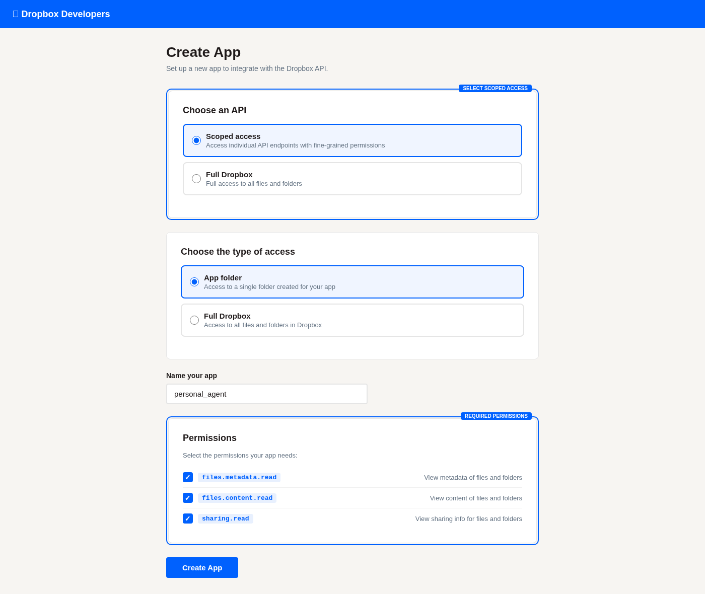

**Click path:**

1. <https://www.dropbox.com/developers/apps> → **Create app**.
2. Choose API: **Scoped access**. Type of access: **Full Dropbox** (or App
   folder if you want to limit scope). Name: `personal_agent`. Create.
3. **Permissions** tab → check: `files.metadata.read`, `files.content.read`,
   `sharing.read`. (Optionally `sharing.write` if you want share-link
   generation.) **Submit**.
4. **Settings** tab → **OAuth 2 → Redirect URIs** → add `http://localhost:53682`
   (exact match). Save.
5. Copy **App key** and **App secret**. Paste as **DROPBOX_APP_KEY** and
   **DROPBOX_APP_SECRET**.
6. In the wizard, click **Connect** for Dropbox. It opens a browser, you grant
   access, the refresh token caches to `data/dropbox_token.json`.

###  Spotify

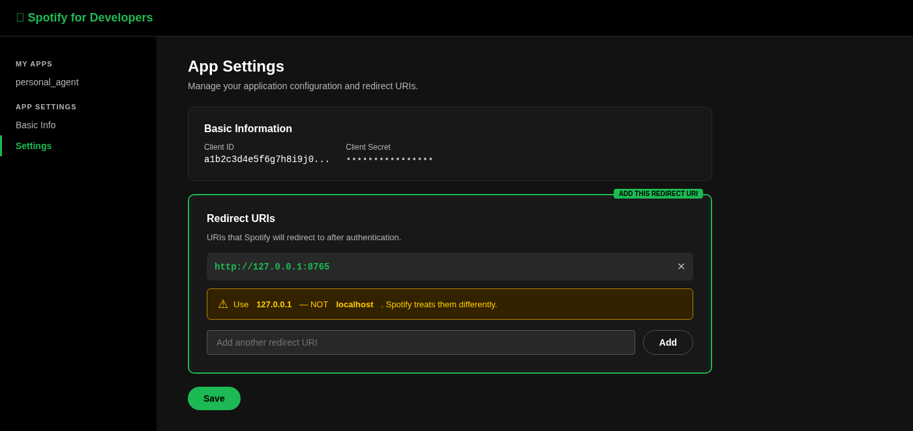

**Click path:**

1. <https://developer.spotify.com/dashboard> → **Create app**.
2. App name: `personal_agent`. App description: anything. Redirect URI:
   `http://127.0.0.1:8765` (must be exactly this — Spotify rejects `localhost`
   as of 2025). API: **Web API**. Save.
3. App → **Settings** → copy **Client ID** + **Client Secret**. Paste as
   **SPOTIFY_CLIENT_ID** and **SPOTIFY_CLIENT_SECRET**.
4. In the wizard, click **Connect** for Spotify. Browser → grant → token caches.

**Playback control needs Spotify Premium.** Free accounts can use search +
playlist read-only.

###  Maps (Google) — optional

**OpenStreetMap is the default** — no key, free, works out of the box. Skip
this step entirely if you're OK with OSM (Nominatim + OSRM) for places +
drive times.

For Google Maps (faster + more detailed):

1. <https://console.cloud.google.com> → same or new project.
2. **APIs & Services → Library** → enable: **Places API**, **Geocoding API**,
   **Distance Matrix API**.
3. **Credentials → Create credentials → API key**. Restrict to the three APIs
   above.
4. Add a billing account (Google requires one even for the free tier — you get
   a $200/mo credit which more than covers personal use).
5. Copy the key → paste as **GOOGLE_MAPS_API_KEY**.

Also set **USER_HOME_ADDRESS** so the agent treats `"home"` as a valid origin
for drive-time queries.

###  Eight Sleep

**Caveat:** Eight Sleep has no public API. This sub-agent talks to the same
endpoints the iOS app uses. Could break without notice — the sub-agent
isolates failures so the rest of the agent keeps running.

**Click path:**

1. The wizard asks for your **Eight Sleep account email** → save as
   **EIGHT_EMAIL**.
2. For the password: run `python -m tools.eightsleep_set_password` after the
   wizard finishes. This stores the password in the **macOS Keychain** under
   service `personal_agent_eight_sleep`, account `<your email>`. Recommended
   over plaintext `.env`.
3. If you can't use Keychain (Linux/Windows fork), set **EIGHT_PASSWORD** in
   `.env`. The auth resolver checks Keychain first and falls back to env.

###  Canva

**Click path:**

1. <https://developer.canva.com> → sign in → **Integrations** → **Create
   integration**.
2. **Authentication** → add Redirect URL EXACTLY `http://127.0.0.1:8767`.
3. **Scopes** → check: `design:meta:read`, `design:content:read`,
   `design:content:write`, `folder:read`, `asset:read`, `profile:read`.
4. Copy **Client ID** + **Client Secret** → paste as **CANVA_CLIENT_ID** and
   **CANVA_CLIENT_SECRET**.
5. Wizard → Connect → browser → grant → token caches.

###  LinkedIn

**Caveat:** narrow API. You can read your own profile and post text updates;
most other endpoints are partner-restricted. Skip unless you specifically want
"post my draft to LinkedIn" as a workflow.

**Click path:**

1. <https://www.linkedin.com/developers/apps> → **Create app**. You need a
   LinkedIn Page you admin to associate it with.
2. **Auth** tab → add Authorized redirect URL EXACTLY `http://127.0.0.1:8768`.
3. **Products** tab → request "Sign In with LinkedIn using OpenID Connect" and
   "Share on LinkedIn" (both auto-approved).
4. Copy **Client ID** + **Client Secret** → paste as **LINKEDIN_CLIENT_ID** and
   **LINKEDIN_CLIENT_SECRET**.
5. Wizard → Connect → browser → grant → token caches.

**Note:** LinkedIn personal-tier tokens **don't refresh automatically**. They
expire after ~55 days. You'll need to re-run Connect when that happens.

---

##  5. Schedule + email triage

The scheduler daemon fires:

- A **morning brief** at a fixed time (default 07:30 local).
- A **Sunday weekly review** at a fixed time (default 20:00).
- **Real-time email pings** when Gmail receives a message the agent thinks
  you'd want to know about right now (LLM-classified per email; off by
  default — `EMAIL_TRIAGE_LOCAL_ONLY=true` to opt out entirely).
- **Delivery alerts** when carriers (UPS / FedEx / USPS / DHL / Amazon) send
  "out for delivery" / "delivered" emails.
- **Expected-arrivals gap detection** for named events you're expecting prep
  materials for (e.g., "no email from Kara yet about Monday's board meeting").

The wizard's triggers step lets you flip each of these on/off and set timing.
The underlying config lives in `config/triggers.yaml`. You can also edit it
directly at `/config/triggers` — the scheduler re-reads on every tick (~30s),
no restart needed.

---

##  6. Behavior defaults

Two settings:

- **USER_TIMEZONE** — IANA timezone string like `America/Chicago`. Used by the
  scheduler to fire briefs at the right local time.
- **CLAUDE_MODEL** — default `claude-sonnet-4-6`. The scheduler overrides per-
  trigger (briefs use Opus 4.7, email triage uses Haiku 4.5).

You can also edit `config/personality.md` from `/config/personality` to tune
the agent's voice. Restart the relay after personality edits.

---

##  7. Install LaunchAgents

The last wizard step runs `./launch_agents/install.sh` which installs and
starts four LaunchAgents:

- `com.personal-agent.relay` — the transport relay (iMessage, Telegram, etc.)
- `com.personal-agent.scheduler` — morning brief, reminders, email watch,
  delivery watch, expected arrivals, retention purges
- `com.personal-agent.log-rotation` — daily at 03:00, rotates daemon logs
- `com.personal-agent.webui` — this web UI at `http://127.0.0.1:8780`

After install, the daemons start on every login and stay running. Restart any
of them at any time from `/settings` or with
`launchctl kickstart -k gui/$(id -u)/com.personal-agent.<name>`.

---

##  Troubleshooting

**The wizard 404s on `/wizard`.** The webui daemon needs a restart after
pulling new code. `launchctl kickstart -k gui/$(id -u)/com.personal-agent.webui`.

**Verify says my API key is invalid.** Re-check the value (no trailing whitespace,
no quotes). Test directly with `curl https://api.anthropic.com/v1/messages -H
"x-api-key: $ANTHROPIC_API_KEY" -H "anthropic-version: 2023-06-01"` — a 400 on a
malformed request body means the key is valid; a 401 means the key isn't.

**iMessage relay says "cannot read chat.db".** Full Disk Access is missing for
the Python binary. System Settings → Privacy & Security → Full Disk Access →
add the `.app` bundle from the Python install path.

**Telegram bot doesn't reply.** Did you `/start` the bot from your phone? The
allowlist is checked against the numeric Telegram user ID, not the phone
number — find yours via @userinfobot.

**Discord channel messages ignored.** Did you enable Message Content Intent
in the bot config? Without it, the bot can only see commands, not channel
text.

**Slack bot silent in a channel.** Did you `/invite @your-bot` to the channel
AND subscribe the app to `message.channels` (or `message.groups` /
`message.mpim` for private rooms)?

**SMS not delivering inbound.** Twilio's webhook URL needs to be publicly
reachable HTTPS. Did ngrok exit? Is the relay listening on the configured
port? Use `curl -X POST http://127.0.0.1:8781/sms/health` to confirm the
relay's up; check Twilio's debugger log to see if Twilio is even hitting your
URL.

**Google OAuth fails with "blocked".** Did you add yourself as a Test User on
the OAuth consent screen? Google blocks unverified apps for anyone who isn't
on the test-user list.

**Eight Sleep auth fails.** They periodically change endpoints (unofficial
API). If `--check` fails, file an issue or check whether pyEight (the home-
assistant package) has the same problem.

**Cost is way higher than expected.** `python -m tools.cost_report --days 7` —
look at which trigger fired most. Common culprits: email triage running too
often (lower `every_minutes` in triggers.yaml), or a build-day spike from
iterating on personality.md.

For everything else: the daemon logs at `data/*.log` are usually the answer.
Tail them in the web UI's Observability page or directly:
`tail -f data/relay.log data/scheduler.log`.

---

## More

- [README.md](v1/README.md) — what this is, what it isn't, threat model
- [ROADMAP.md](v1/ROADMAP.md) — what's shipped, what's still open
- [CONTRIBUTING.md](CONTRIBUTING.md) — fork-and-modify expectations
- [SECURITY.md](SECURITY.md) — disclosure path

The wizard mirrors this guide at `http://127.0.0.1:8780/about/setup` if you'd
rather read it in the browser.
